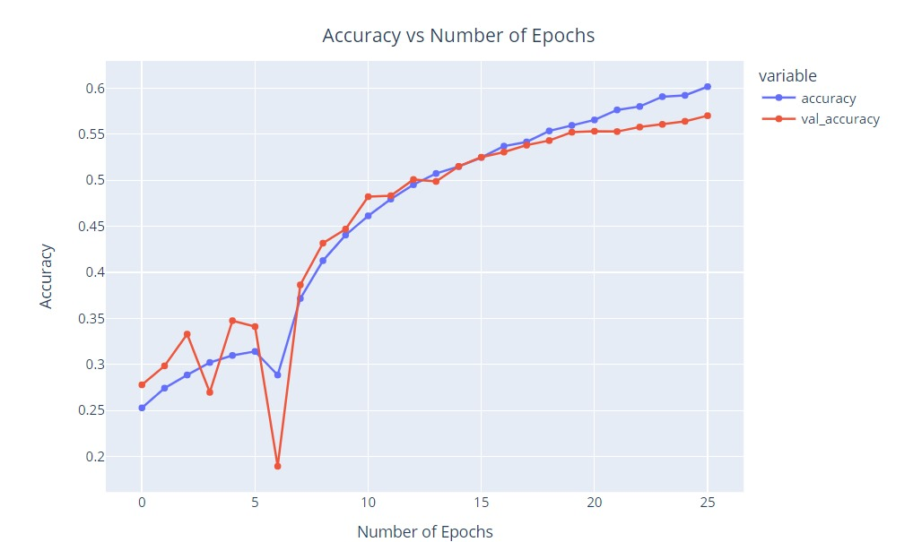
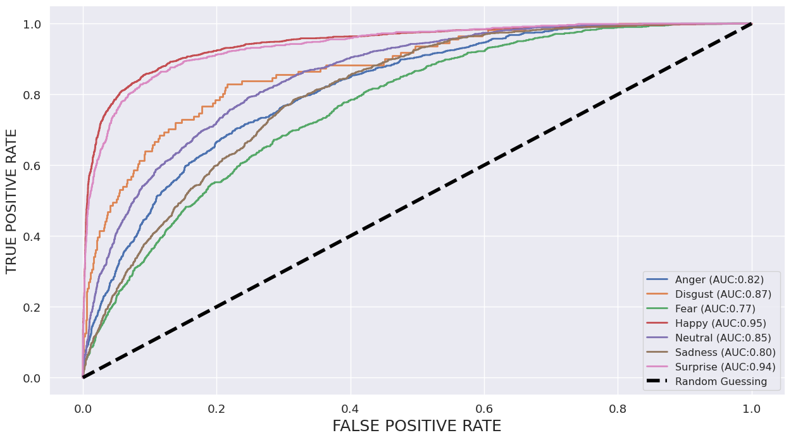

# 📊 Task-1: Comparing Time-Series Models with Static Image-Based Approaches for Emotion Recognition

### 🎯 Objective:
Compare the performance of time-series models with static image-based approaches to determine which method is more effective for emotion recognition.

### 📂 Project Files:
- **`README.md`** - Updated with project overview and instructions.
- **`Task 1 report.pdf`** - Detailed report of Task 1, summarizing the findings and comparisons.
- **`null-1 (2).ipynb`** - Jupyter notebook with code and analysis for Task 1.
- **`.gitignore`** - Git ignore file to exclude unnecessary files from version control.
- **`LICENSE`** - Project license for usage rights.

### 📈 Performance Metrics:
- **Accuracy Inception:** 
- **Accuracy ResNet:** 
- **Loss Inception:** 
- **Loss ResNet:** 
- **Confusion Matrix Inception FER:** 
- **Confusion Matrix ResNet FER:** 
- **ROC AUC Inception FER:** 
- **ROC AUC ResNet FER:** 
- **Dataset Distribution:** 

### 🎥 Demo Video:
Watch the demo video showcasing the performance comparison of the models:
[View Demo Video](https://github.com/Anidipta/Task-1/assets/140332086/b8623542-d0af-4ff7-9797-ec25d8f738d8)

### 🔍 Project Highlights:
- **Model Comparison:** Evaluates the effectiveness of time-series models vs. static image-based approaches for emotion recognition.
- **Visual Analytics:** Detailed performance metrics and visualizations to compare the models' accuracy, loss, and ROC AUC scores.
- **Insights:** Provides insights into the strengths and weaknesses of each approach in different scenarios.

Feel free to explore the provided files, images, and demo video to understand the comparative performance and the effectiveness of the models used.
